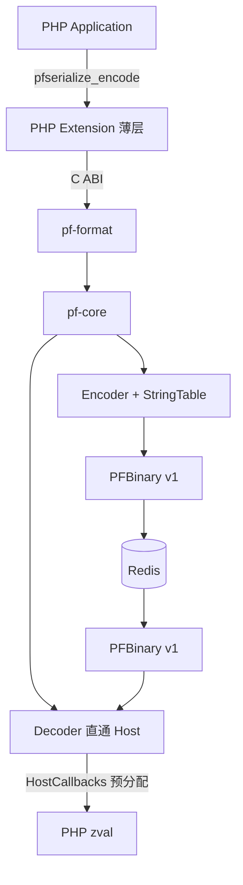

# PFSerialize 技术架构设计 v1.0

**文档版本：** 1.0  
**状态：** 定稿（实现前）  
**关联规范：** [protocol-v1.md](./protocol-v1.md)  
**需求来源：** 仓库根目录 [README.md](../README.md)

---

## 1. 一句话定义

> PFSerialize 是一个由 Rust 驱动、面向 PHP 老系统 Redis 缓存场景的二进制序列化引擎；V1 以 **Decode 延迟** 与 **Payload 体积** 为第一优化目标，通过薄 PHP 扩展对接 Zend API。

---

## 2. 架构总览

```text
                    PHP Application
                          │
                pfserialize_encode / decode
                          │
                          ▼
              ┌────────────────────┐
              │ php/ Extension     │  Zend API 适配（薄层）
              │ 仅做 zval ↔ 调用   │
              └─────────┬──────────┘
                        │ C ABI (extern "C")
                        ▼
              ┌────────────────────┐
              │ pf-format          │  Header / Tag / Version 分发
              └─────────┬──────────┘
                        │
                        ▼
              ┌────────────────────┐
              │ pf-core            │  Encoder / Decoder / VarInt /
              │                    │  StringTable / Error
              └─────────┬──────────┘
                        │
                        ▼
                   PFBinary v1
                        │
                      Redis
```



### 2.1 分层职责

| 层 | 职责 | 禁止 |
|----|------|------|
| PHP Extension | 解析 PHP 参数、调用 ABI、把错误码映射为 PHP 异常/FALSE、管理返回 `string`/`zval` | 任何 wire 格式逻辑、Tag 解析 |
| pf-format | Magic/Version/Flags/Checksum、`decode_v1` 入口 | Zend 类型、业务策略 |
| pf-core | 纯编解码算法、VarInt、String Table、安全计数 | 依赖 PHP 头文件 |

**核心约束（README §13）：** Decoder **禁止** `Binary → Rust Value AST → 再转 zval`。必须 `Binary → 边解析边通过 Host 回调构造 zval`。

---

## 3. 仓库模块划分

对应 README §8，V1 落地结构：

```text
pfserialize/
├── Cargo.toml                 # workspace
├── README.md
├── LICENSE
├── crates/
│   ├── pf-core/               # 纯 Rust 编解码
│   │   ├── src/
│   │   │   ├── lib.rs
│   │   │   ├── encoder.rs
│   │   │   ├── decoder.rs     # 泛型 Host，见 §6
│   │   │   ├── varint.rs
│   │   │   ├── string_table.rs
│   │   │   ├── error.rs
│   │   │   └── host.rs        # Host / HostCallbacks trait
│   │   └── Cargo.toml
│   ├── pf-format/             # tag 常量、header、版本分发
│   │   ├── src/
│   │   │   ├── lib.rs
│   │   │   ├── tags.rs
│   │   │   ├── header.rs
│   │   │   └── version.rs
│   │   └── Cargo.toml
│   ├── pf-ffi/                # C ABI 导出（cdylib/staticlib）
│   │   ├── src/lib.rs
│   │   ├── include/pfserialize.h
│   │   └── Cargo.toml
│   ├── pf-bench/              # Rust 侧微基准（VarInt/Encoder）
│   └── pf-cli/                # 可选：hex dump / roundtrip 工具
├── php/
│   ├── php_pfserialize.h
│   ├── pfserialize.c          # 模块入口
│   ├── php_functions.c        # PHP_FUNCTION(*)
│   ├── host_php56.c           # HostCallbacks 的 PHP 5.6 实现
│   └── config.m4
├── tests/
│   ├── compatibility/
│   ├── roundtrip/
│   ├── malformed/
│   └── regression/
├── benchmarks/
│   ├── serialize.php
│   ├── igbinary.php
│   ├── json.php
│   └── pfserialize.php
└── docs/
    ├── protocol-v1.md
    └── architecture-v1.0.md   # 本文档
```

说明：`pf-ffi` 从计划目录中单列，避免 `pf-core` 直接关心 `extern "C"` 与指针所有权。

---

## 4. 竞品调研摘要与可借鉴点

### 4.1 igbinary

- 线格式：`\x00\x00\x00\x02` + 约 37 个定宽变体 Tag。
- 字符串：内联首次定义 + `string_id8/16/32`。
- 数组：一律写键（packed 也写 `0..n-1`）。
- **弱点（本项目机会）：** tag 分支多、无 packed 特化、id 定宽浪费、decode 未强调预分配。

### 4.2 phpser（iliaal/phpser）

定位同样是 decoder-oriented cache serializer，主要面向 **PHP 8.2+**。关键手法：

| 手法 | 收益 | PFSerialize V1 采纳 |
|------|------|---------------------|
| `PACKED_LEN` + `zend_new_array(N)` + 直写 packed 存储 | 省掉 N 次 hash insert | **采纳原则**：预分配；PHP 5.6 用 `zend_hash_init`/`array_init_size` |
| 同质 `PACKED_LONGS`（无 per-element tag） | packed 整数 decode 极快 | **已实现（`0x0A`）** |
| PHP 扩展 C 内联解码 | 去掉 Decode FFI | **已实现**（纯 C；checksum 拒绝） |
| PHP 扩展 C 内联编码 | 去掉 Encode FFI | **已实现**（纯 C；checksum 拒绝） |
| 声明 count vs remaining bytes | 防 DoS 分配 | **必须采纳** |
| HMAC 签名帧 | 不可信存储 | V1 仅可选 XXH3；签名放后期 |
| 前置/字典 + pointer intern | encode 快 | Rust Encoder 可用 HashMap；线格式保持内联定义 |
| ROWSET / TABLE 列式 | DB 结果集 | V2+ |

**差异化：** phpser 不做 PHP 5.6；PFSerialize V1 **强制支持 PHP 5.6**，并坚持 Rust 核心与 Zend 薄适配分离，便于后续扩到 7.x/8.x 而不改协议。

---

## 5. PHP 5.6 zval 映射

| PFBinary Tag | PHP 5.6 构造 | 备注 |
|--------------|--------------|------|
| `NULL` | `ZVAL_NULL(z)` | |
| `FALSE` / `TRUE` | `ZVAL_BOOL(z, 0/1)` | |
| `VARINT` | `ZVAL_LONG(z, (long)n)` | 32 位 PHP 上超出 `long` 范围 → `ZVAL_DOUBLE` |
| `DOUBLE` | `ZVAL_DOUBLE(z, d)` | |
| `STR_EMPTY` | `ZVAL_EMPTY_STRING(z)` 或 `ZVAL_STRINGL(z, "", 0, 1)` | 拷贝语义 |
| `STR_VARINT` / `STR_REF` | `ZVAL_STRINGL(z, ptr, len, 1)` | **V1 一律拷贝**（决策 D5） |
| `ARRAY_PACKED` | `array_init_size` / `ALLOC_HASHTABLE` + `zend_hash_init(ht, count, …)` 后 `zend_hash_next_index_insert` | 预分配 `count` |
| `ARRAY_HASH` | 同上预分配后 `zend_hash_update` / `zend_hash_index_update` | 字符串键需 `zend_symtable_*` 注意数字字符串键 |

资源类型（`IS_RESOURCE`）：Encode 阶段拒绝，返回错误（与 `serialize` 类似不可序列化）。

---

## 6. Decoder 直通设计（Host 回调）

### 6.1 错误方式（禁止）

```text
Binary → Rust enum Value { ... } → 遍历 Value → 创建 zval
```

问题：双倍内存、双倍遍历、cache 不友好，违背 Decode 优先。

### 6.2 正确方式

```text
Binary → pf-core Decoder
              │
              ├─ on_null / on_bool / on_i64 / on_f64
              ├─ on_string(bytes)
              ├─ on_array_begin(kind, count) → Host 预分配
              ├─ on_array_key_* / on_array_value_done
              └─ on_array_end
                    │
                    ▼
              PHP Host（host_php56.c）直接写 zval
```

### 6.3 Rust 侧接口草图

```rust
/// 由 PHP 适配层实现；pf-core 无 PHP 知识。
pub trait Host {
    type Value;       // 例如持有 zval* 的句柄
    type ArrayState;  // 正在填充的数组

    fn make_null(&mut self) -> Result<Self::Value, Error>;
    fn make_bool(&mut self, v: bool) -> Result<Self::Value, Error>;
    fn make_i64(&mut self, v: i64) -> Result<Self::Value, Error>;
    fn make_f64(&mut self, v: f64) -> Result<Self::Value, Error>;
    fn make_string(&mut self, bytes: &[u8]) -> Result<Self::Value, Error>;

    fn begin_array(&mut self, packed: bool, count: u32) -> Result<Self::ArrayState, Error>;
    fn push_packed(&mut self, arr: &mut Self::ArrayState, val: Self::Value) -> Result<(), Error>;
    fn insert_long_key(&mut self, arr: &mut Self::ArrayState, key: i64, val: Self::Value) -> Result<(), Error>;
    fn insert_string_key(&mut self, arr: &mut Self::ArrayState, key: &[u8], val: Self::Value) -> Result<(), Error>;
    fn end_array(&mut self, arr: Self::ArrayState) -> Result<Self::Value, Error>;
}
```

纯 Rust 单测可提供 `Host` 实现，把结果建成 `serde_json::Value` 或自有 `TestValue`，**无需链接 PHP**。

Encoder 路径对称：从 Host 只读遍历（PHP 侧把 HashTable walk 做成回调，或 FFI 层先走 C 递归调 `pf_encode_*` 细粒度 API）。V1 推荐 **细粒度 encode API**（见 §7），由 `host_php56.c` 递归 walk zval。

---

## 7. Rust / C ABI

头文件：`crates/pf-ffi/include/pfserialize.h`。

### 7.1 错误码

```c
typedef enum pf_err {
    PF_OK = 0,
    PF_E_BAD_MAGIC = 1,
    PF_E_UNSUPPORTED_VERSION = 2,
    PF_E_UNKNOWN_FLAGS = 3,
    PF_E_CHECKSUM = 4,
    PF_E_TRUNCATED = 5,
    PF_E_TRAILING = 6,
    PF_E_UNKNOWN_TAG = 7,
    PF_E_BAD_KEY = 8,
    PF_E_VARINT = 9,
    PF_E_BAD_STRREF = 10,
    PF_E_MAX_DEPTH = 11,
    PF_E_MAX_SIZE = 12,
    PF_E_OVERFLOW = 13,
    PF_E_UNSUPPORTED_TYPE = 14, /* 如 resource / object in V1 */
    PF_E_HOST = 15,             /* Host 回调失败 */
    PF_E_INTERNAL = 127
} pf_err;
```

与 [protocol-v1.md](./protocol-v1.md) §10.2 一一对应。

### 7.2 缓冲区所有权

```c
/* 释放 pf_encode 分配的缓冲 */
void pf_free(uint8_t *ptr);

/* 编码：成功时 *out 为 malloc 缓冲，*out_len 为长度；调用方 pf_free */
pf_err pf_encode(
    const pf_host_vtable *host,
    void *host_ctx,
    void *root_zval,          /* 对 PHP Host：zval* */
    uint8_t **out,
    size_t *out_len,
    uint8_t flags             /* 写入 Header Flags */
);

/* 解码：成功时 *out_zval 为已构造完成的 zval（由 Host 分配） */
pf_err pf_decode(
    const pf_host_vtable *host,
    void *host_ctx,
    const uint8_t *data,
    size_t len,
    void *out_zval,
    uint32_t max_depth,       /* 0 = 默认 100 */
    size_t max_size           /* 0 = 默认 10*1024*1024 */
);
```

`pf_host_vtable` 即 §6.3 Host 方法的 C 函数指针表，由 `host_php56.c` 填充。

### 7.3 仅测协议的无 Host API（可选）

```c
/* 把 Value 编码到缓冲；输入为简易 C 值树 —— 供 CLI/测试，生产 PHP 路径不走此 API */
```

V1 可不实现；优先 PHP Host + Rust 单测 Host。

### 7.4 线程与可重入

- Encoder/Decoder 状态在栈上 / 调用期内堆分配，**无全局可变状态**。
- String Table 为每次调用私有。
- 可在多请求并发下使用（每个请求独立调用）。

---

## 8. 安全边界

| 控制项 | 默认 | 行为 |
|--------|------|------|
| `max_depth` | 100 | 超限 `PF_E_MAX_DEPTH` |
| `max_size` | 10 MiB | 累计声明字符串长度 + 数组节点估算超限 → `PF_E_MAX_SIZE` |
| remaining-bytes | — | 任何 `count`/`len` 分配前校验 |
| Object / `__wakeup` | V1 禁止 | 见 Object → `PF_E_UNSUPPORTED_TYPE`；**绝不**自动执行魔术方法 |
| 未知 Tag / Flags | — | 硬失败 |
| Checksum | 默认关 | Flags 开启则先校验再解析 |

递归：Rust Decoder 可用显式 `depth` 计数的递归，或栈式迭代；无论哪种，必须强制 `max_depth`。  
推荐：热路径递归 + depth 参数，简单且足够（深度 100 远低于典型栈限额）。

---

## 9. PHP 用户 API（V1）

```php
function pfserialize_encode($value): string|false {}

function pfserialize_decode(
    string $binary,
    int $max_depth = 100,
    int $max_size = 10485760
); // mixed|false

function pfserialize_size($value): int|false {}

function pfserialize_stats($value): array|false {}
// [
//   'original_size' => int,      // strlen(serialize($value)) 可选昂贵；或估算
//   'serialized_size' => int,
//   'compression_ratio' => float,
//   'string_count' => int,       // String Table 条目数
// ]
```

错误处理 V1：失败返回 `false` 并视需要 `E_WARNING`（与 `igbinary_serialize` 风格接近）；不在 V1 引入异常模式开关。

**明确不做（V1）：**

- `pfredis_set` / `pfredis_get`
- Redis serializer handler
- `PF_MODE_*` 兼容模式切换
- igbinary 读写

---

## 10. Redis 集成（V1 范围）

仅文档与示例级集成：

```php
$redis->set('user:10001', pfserialize_encode($data));
$data = pfserialize_decode($redis->get('user:10001'));
```

灰度迁移（README §28）作为 **运维模式** 描述在后续 `docs/migration.md`，不阻塞 V1 架构：应用层 try PFBinary → 失败则 `igbinary_unserialize`。Magic `PFBN` 用于快速分流。

---

## 11. Benchmark 对接

### 11.1 数据集（README §29）

| ID | 内容 | 验证点 |
|----|------|--------|
| A | scalar | Tag 开销基线 |
| B | small associative | 样例 A |
| C | 1000 rows DB result | 重复键 String Table |
| D | deep nested | `max_depth`、decode 延迟 |
| E | 重复字符串 | 样例 B |
| F | packed numeric | 样例 C；对照未来 PACKED_LONGS |
| G | object collection | **V1 跳过或仅测「拒绝」** |

### 11.2 指标

Encode/Decode latency（P50/P95/P99）、Payload size、PHP peak memory、错误注入存活率。  
端到端：`SET → GET → decode`（README §31）。

### 11.3 通过门槛（对齐 README §33 V1 KPI）

| 指标 | V1 目标 | 架构如何支撑 |
|------|---------|--------------|
| 比 serialize 小 | ≥ 30% | VarInt + String Table + PACKED 省键 |
| Decode ≥ serialize | 必须 | 直通 zval、预分配 HT |
| Decode vs igbinary | 不低于 | 更少 tag 分支 + packed；需 bench 证实 |
| Encode vs serialize | ≤ 1.2× | 允许去重 HashMap 开销 |
| 错误数据检测 | 100% | malformed 套件 |
| Roundtrip | 100% | tests/roundtrip |
| PHP 5.6 / Linux x86_64 | 必须 | host_php56 + CI |
| Redis | 必须 | 示例 + e2e bench |

---

## 12. 关键设计决策记录

### D1 — 整数编码：ZigZag + LEB128

- **选项：** (a) igbinary 式定宽 Tag 族 (b) ZigZag+LEB128 (c) 定宽优先 + 稀有变长  
- **决定：** (b)  
- **理由：** Tag 空间小、业务 ID 常落在 1–3 字节、实现简单。  
- **风险：** 变长解析分支预测；用 Dataset F bench 验证，若显著慢于 igbinary 再考虑 V1.1 `PACKED_LONGS`。

### D2 — String Table：内联首次定义

- **选项：** (a) 前置独立区块 (b) 内联 + STR_REF  
- **决定：** (b)  
- **理由：** 单遍 encode、峰值内存低；与 igbinary/phpser 经验一致；id 用 varint 优于定宽。  
- **放弃 (a) 的理由：** 两遍扫描或整树缓冲，抬高 Encode 成本。

### D3 — 校验：默认关，可选 XXH3-32

- **决定：** Flags bit0，默认 0；算法固定 XXH3 低 32 位。  
- **理由：** 缓存热路径默认零开销；需要时打开。HMAC 留给不可信存储场景的后续版本。

### D4 — Reference / Object：V1 不做，号段预留

- **决定：** Tag `0x40–0x7F` 预留；Decoder 遇之失败。  
- **理由：** 避免 V1 变成兼容性泥潭；同时防止 V2 破坏性改 Header。

### D5 — Zero-copy：V1 不做

- **决定：** 字符串一律拷入 PHP 内存（`ZVAL_STRINGL(..., 1)`）。  
- **理由：** Redis 缓冲与 PHP 生命周期解耦，正确性优先（README §14）。

### D6 — 实现语言边界（补充）

- **决定：** 协议与算法在 Rust；Zend 细节仅在 `php/`。  
- **理由：** 可单测、可多 PHP 版本复用同一 `cdylib`。

---

## 13. V1 开发顺序（与 README §37 对齐）

1. **pf-format + pf-core**：VarInt、Header、roundtrip（Test Host）  
2. **malformed 模糊用例**（无 PHP）  
3. **pf-ffi + php/ PHP 5.6**：四个用户 API  
4. **benchmarks/** 对 serialize / json / igbinary  
5. **真实 Redis e2e**；不达标则停或改协议（如引入 `PACKED_LONGS`）

---

## 14. 手工样例与 KPI 对齐结论

依据 [protocol-v1.md](./protocol-v1.md) §12：

| 样例 | 协议要点 | 对 KPI 的贡献 |
|------|----------|---------------|
| A 关联数组 | HASH + 字符串键入表 | 体积 vs serialize |
| B 重复 status | STR_REF 密集 | ≥30% 缩减主战场 |
| C `[1,2,3,4]` | PACKED 无键；完整 hex 已给出 | decode 预分配；对照 igbinary 省 4 组键 |

**结论：** 协议无歧义，三个样例均可唯一编码；架构上的直通 Host + 预分配足以支撑 V1 KPI 的「可达成性」，最终数字以 Phase 4 Redis bench 为准。

---

## 15. 开放问题（不阻塞 V1 编码）

1. PHP 7/8 Host 是否与 5.6 共用同一扩展代码（`#ifdef`）还是分目录——建议 V2 再拆。  
2. `pfserialize_stats` 的 `original_size` 是否调用 `serialize()`（准但慢）——建议默认不算，或显式 flag。  
3. NaN 比特规范化策略——实现时固定并写入测试向量。  
4. 是否提供 `strict_trailing` ini（拒绝尾部字节）——建议默认拒绝。

---

## 16. 变更记录

| 版本 | 日期 | 说明 |
|------|------|------|
| 1.0 | 2026-09-10 | 首版：模块划分、Host 直通、C ABI、安全边界、D1–D6、竞品借鉴 |
